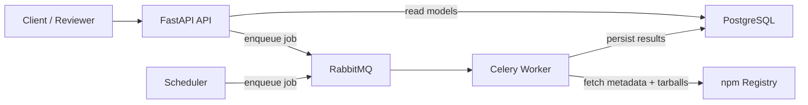

# npm-sentinel

`npm-sentinel` is a FastAPI backend for npm package risk intelligence.
It scans package releases with static analysis, stores durable findings in PostgreSQL,
and exposes searchable APIs for security review.

## What This Service Does

- Compares package `latest` and `previous` npm versions.
- Detects suspicious indicators (install hooks, binaries, obfuscation, command execution, size jumps).
- Computes a risk score (`1..100`) and risk level (`low | medium | high`).
- Persists scan history, findings, and queue job lifecycle for auditability.
- Supports manual scans and scheduler-driven top-package monitoring.

## High-Level Architecture

The project is a modular monolith with separate runtime processes:

- `api` (`FastAPI`): validates requests, exposes read/query APIs, enqueues scans.
- `worker` (`Celery`): consumes jobs and runs end-to-end static scan pipeline.
- `scheduler`: periodically checks package updates and enqueues scans.
- `postgres`: source of truth for package, version, scan, finding, and queue-job state.
- `rabbitmq`: async broker for durable scan job delivery.



## Why This Design

- API stays fast because heavy scan work runs out-of-band in workers.
- Workers remain stateless; horizontal scaling is safe.
- Queue and DB preserve job/result state across restarts.
- Separation of route handlers and use-cases keeps business logic maintainable.

## Internal Data Flow

1. API request or scheduler decides a package scan should run.
2. A `queue_jobs` row is created and a Celery task is published.
3. Worker marks queue job `running` and creates a `scan_results` attempt.
4. Worker fetches npm metadata (`latest`, `previous`), stores version metadata.
5. Worker downloads and safely extracts tarballs to temporary directories.
6. Static analyzer runs all detectors and builds findings list.
7. Domain scoring computes score and risk level.
8. Worker writes findings, marks scan `completed` or `failed`, updates queue job state.
9. API serves package/scans/findings for review and filtering.

## Codebase Layout

```text
app/
  api/                # FastAPI routes + request/response schemas
  application/        # use-cases + ports (interfaces)
  domain/             # scoring + enums + core entities
  infrastructure/     # DB, queue, npm, scanner implementations
  scheduler/          # periodic monitoring runner
  worker/             # Celery app and tasks
alembic/              # DB migrations
tests/                # API, unit, and integration tests
evidence/             # sample logs/responses/findings for reviewers
```

## Detection Engine

The scanner is static-analysis only. Package code is **never executed**.

Implemented detectors:

- `INSTALL_HOOK_PRESENT` / `INSTALL_HOOK_ADDED` / `INSTALL_HOOK_REMOVED`
- `SIZE_INCREASE_MEDIUM` / `SIZE_INCREASE_HIGH`
- `EXECUTABLE_BINARY` (extensions + magic bytes)
- `OBFUSCATED_CODE` (obfuscation-like source patterns)
- `COMMAND_EXECUTION_PATTERN` (process/shell execution patterns)

Safety controls:

- Archive path traversal checks.
- Max archive members / max bytes / max file size / max path depth.
- Scanner file-count and text-file size limits.
- Bounded evidence text persistence.

## Scoring Model

Base score is `1` and score is capped at `100`.

| Finding Type | Score Delta |
| --- | ---: |
| `EXECUTABLE_BINARY` | +25 |
| `INSTALL_HOOK_ADDED` | +20 |
| `COMMAND_EXECUTION_PATTERN` | +15 |
| `OBFUSCATED_CODE` | +15 |
| `SIZE_INCREASE_HIGH` | +10 |
| `SIZE_INCREASE_MEDIUM` | +5 |
| `INSTALL_HOOK_PRESENT` | +5 |
| `INSTALL_HOOK_REMOVED` | +0 |

Risk bands:

- `1..30`: `low`
- `31..70`: `medium`
- `71..100`: `high`

## Database Model (Core Tables)

- `packages`: package identity + latest scanned version marker.
- `package_versions`: immutable per-version metadata from npm.
- `scan_results`: each scan attempt with lifecycle + score/risk/error.
- `findings`: normalized finding records tied to one scan result.
- `queue_jobs`: durable queue lifecycle (`queued/running/completed/failed`) by task id.

Concurrency/idempotency notes:

- Duplicate queue deliveries produce separate scan attempts safely.
- Unique constraints avoid duplicate package/version rows.
- Late failures do not overwrite already completed scan attempts.

## API Documentation (Swagger / OpenAPI)

After the API starts:

- Swagger UI: `http://localhost:8000/docs`
- ReDoc: `http://localhost:8000/redoc`
- OpenAPI JSON: `http://localhost:8000/openapi.json`

Swagger is the fastest way to explore and test endpoints:

1. Open `/docs`.
2. Expand an endpoint.
3. Click **Try it out**.
4. Submit and inspect live request/response payloads.

The repo has automated coverage to ensure docs endpoints stay available (`tests/test_openapi_docs.py`).

## API Endpoints

### Health

- `GET /api/v1/health`

### Enqueue Scans

- `POST /api/v1/packages/{package_name}/scans`
- `POST /api/v1/scans/{package_name}` (compat alias)
- `POST /api/v1/scan-batches`
- `POST /api/v1/scans/top-packages` (compat alias)

### Read Models

- `GET /api/v1/packages`
- `GET /api/v1/packages/{package_name}`
- `GET /api/v1/package-versions/{package_name}`
- `GET /api/v1/scans`
- `GET /api/v1/findings`

Useful filters:

- `/api/v1/packages?risk_level=high&name=lodash`
- `/api/v1/scans?status=failed&risk_level=high`
- `/api/v1/findings?severity=high&type=executable_binary&package_name=lodash`

## Quick Start (Docker Compose)

1. Copy environment defaults:

```bash
cp .env.example .env
```

2. Build and start all services:

```bash
docker compose up --build
```

3. Verify health:

```bash
curl http://localhost:8000/api/v1/health
```

Expected:

```json
{"status":"ok","service":"npm-sentinel-api"}
```

4. Open Swagger:

```text
http://localhost:8000/docs
```

Optional migration command:

```bash
docker compose run --rm api alembic upgrade head
```

## Manual Usage Examples

Enqueue one package:

```bash
curl -X POST "http://localhost:8000/api/v1/packages/lodash/scans?reason=manual"
```

Enqueue a scoped package:

```bash
curl -X POST "http://localhost:8000/api/v1/packages/@types/node/scans?reason=manual"
```

Enqueue top packages batch:

```bash
curl -X POST "http://localhost:8000/api/v1/scan-batches" \
  -H "Content-Type: application/json" \
  -d '{"source":"top_packages","limit":25,"reason":"manual_batch"}'
```

Read latest scans:

```bash
curl "http://localhost:8000/api/v1/scans?limit=20&offset=0"
```

Read findings:

```bash
curl "http://localhost:8000/api/v1/findings?severity=high&type=executable_binary"
```

## Local Python Development

```bash
python3 -m venv .venv
source .venv/bin/activate
python3 -m pip install --upgrade pip
python3 -m pip install -e ".[dev]"
```

Run API directly (expects DB/broker reachable via env):

```bash
uvicorn app.main:app --host 0.0.0.0 --port 8000 --reload
```

Run worker:

```bash
celery -A app.worker.main:celery_app worker --loglevel=INFO --concurrency=5 --without-gossip --without-mingle --without-heartbeat
```

Run scheduler:

```bash
python3 -m app.scheduler.main
```

## Testing

Run full tests locally:

```bash
python3 -m venv .venv
source .venv/bin/activate
python3 -m pip install --upgrade pip
python3 -m pip install -e ".[dev]"
pytest
```

Run tests in compose container:

```bash
docker compose run --rm --user root api sh -c "python3 -m pip install --no-cache-dir -e '.[dev]' && pytest"
```

Helpful subsets:

```bash
pytest tests/test_openapi_docs.py
pytest tests/test_api_scan_enqueue.py tests/test_api_scans.py
pytest tests/unit
pytest tests/integration
```

## Configuration

Environment variables are loaded from `.env` via `app/core/config.py`.
See `.env.example` for the full list.

Most important settings:

- `DATABASE_URL`
- `CELERY_BROKER_URL`
- `NPM_REGISTRY_BASE_URL`
- `TOP_PACKAGES_SOURCE_URL`
- `TOP_PACKAGE_LIMIT`
- `SCHEDULER_INTERVAL_SECONDS`
- `SCANNER_MAX_FILES`
- `SCANNER_MAX_TEXT_FILE_BYTES`
- `TARBALL_MAX_*` safety bounds

## Evidence Samples

Reviewer-oriented sample outputs live in `evidence/`:

- `evidence/architecture_notes.md`
- `evidence/sample_logs.txt`
- `evidence/sample_api_response.json`
- `evidence/sample_findings.json`

These files are sanitized examples, not production secrets.

## Troubleshooting

- `api` is unhealthy:
  - Check DB connectivity and migration status.
  - Verify `DATABASE_URL` in `.env`.
- Scan stuck in `queued`:
  - Ensure `worker` is running and connected to RabbitMQ.
  - Check worker logs for broker/auth errors.
- Batch enqueue fails:
  - Verify `TOP_PACKAGES_SOURCE_URL` is reachable.
  - Check `scan queue unavailable` responses for broker issues.
- Empty scan results:
  - Confirm package exists on npm and registry requests are not timing out.

## Production Notes

- Run API and worker with horizontal replicas.
- Keep scheduler singleton (or coordinate ticks externally).
- Use secret management instead of plain `.env`.
- Add metrics/tracing/log shipping for observability.
- Tune Celery retry/backoff for registry/network behavior.
- Treat findings and evidence as untrusted user-facing content.

## Current Limitations

- Detection is heuristic; false positives/negatives are possible.
- Comparison is `latest` vs one `previous` version.
- No dynamic runtime/sandbox behavior analysis is performed.
- Local compose is for development/evaluation, not hardened production.
